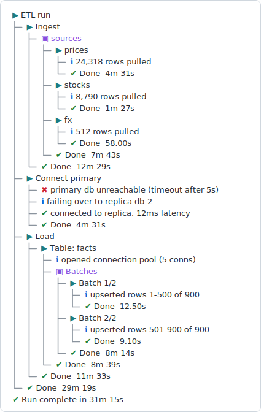

<!-- README.md is generated from README.Rmd. Please edit that file -->

# logtree <a href="https://ivansortino.github.io/logtree/"></a>

<!-- badges: start -->

[Documentation](https://IvanSortino.github.io/logtree/) \|
[GitHub](https://github.com/IvanSortino/logtree)

<!-- badges: end -->

logtree renders nested process execution as a live, colored tree in the
console – tree connectors, status glyphs, and elapsed time per step –
while keeping nesting depth correct even when a step errors partway
through.

<p align="center">


</p>

## Installation

logtree isn’t on CRAN yet. Install the development version from
[GitHub](https://github.com/IvanSortino/logtree):

``` r
# install.packages("pak")
pak::pak("IvanSortino/logtree")
```

Once released to CRAN:

``` r
install.packages("logtree")
```

## Quick start

``` r
library(logtree)

pipeline <- function() {
  log_step("Pipeline")
  load_config()
}

load_config <- function() {
  log_step("Load config")
  log_info("Reading config.yml")
  log_success("Validated 12 parameters")
}

pipeline()
#> ▶ Pipeline
#> ├─ ▶ Load config
#> │  ├─ ℹ Reading config.yml
#> │  ├─ ✔ Validated 12 parameters
#> │  └─ ✔ Done  0.00s
#> └─ ✔ Done  0.00s
```

`log_step()` is meant to be called from inside a function: the step
auto-closes when the function that opened it returns – normally, early,
or via an uncaught error – so nesting depth never gets stuck out of
sync. (At top level, with no function frame to close on, reach for
`log_open()` / `log_close()` instead.)

## Status levels & verbosity

Five leaf levels – `log_debug()`, `log_info()`, `log_success()`,
`log_warn()`, `log_error()` – plus `logtree_threshold()` to filter them.
`log_warn()`/ `log_error()` also elevate the enclosing step’s glyph,
even when suppressed by verbosity; step lines always render regardless
of threshold.

``` r
fetch <- function() {
  log_step("Fetch")
  log_debug("cache miss for key user:42")
  log_info("requesting from API")
  log_warn("rate limit at 80%")
  log_success("fetched 128 rows")
}

with_logging(fetch(), summary = FALSE) # default verbosity ("info"): debug hidden
#> ▶ Fetch
#> ├─ ℹ requesting from API
#> ├─ ⚠ rate limit at 80%
#> ├─ ✔ fetched 128 rows
#> └─ ⚠ Done  0.00s

logtree_threshold("debug")
with_logging(fetch(), summary = FALSE) # verbosity raised: debug shown
#> ▶ Fetch
#> ├─ ⚙ cache miss for key user:42
#> ├─ ℹ requesting from API
#> ├─ ⚠ rate limit at 80%
#> ├─ ✔ fetched 128 rows
#> └─ ⚠ Done  0.00s
logtree_threshold("info")
```

## Error handling

`log_error()` from code that itself returns normally elevates the
enclosing step’s glyph but lets the run continue – pass
`status = "success"` to `log_close()` once you know recovery actually
worked:

``` r
connect_db <- function() {
  log_step("Connect primary")
  log_error("primary unreachable")
  log_info("failing over to replica")
  log_success("connected to replica")
  log_close(status = "success") # recovered: override the elevated glyph
}

with_logging(connect_db(), summary = FALSE)
#> ▶ Connect primary
#> ├─ ✖ primary unreachable
#> ├─ ℹ failing over to replica
#> ├─ ✔ connected to replica
#> └─ ✔ Done  0.00s
```

A step whose code actually throws is different: `with_logging()` marks
every currently-open step failed, logs the condition as a leaf, prints a
run summary, then rethrows – it never silently swallows errors.

``` r
apply_migration <- function() {
  log_step("Apply migration")
  log_info("adding column users.tier")
  stop("constraint violation on users.email")
}

try(with_logging(apply_migration()), silent = TRUE)
#> ▶ Apply migration
#> ├─ ℹ adding column users.tier
#> ├─ ✖ constraint violation on users.email
#> └─ ✖ Done  0.00s
#> ✖ Run failed in 0.00s
```

## Grouping

Adjacent `log_step()` calls that share a `group = c(name = value)` value
collapse under one `< name >` header instead of stacking as siblings:

``` r
check <- function(item, label) {
  log_step(label, group = stats::setNames(item, paste0("Item ", item)))
  log_info(paste0(label, " running"))
  log_success(paste0(label, " ok"))
}

process_item <- function(item) {
  check(item, "validate schema")
  check(item, "check bounds")
}

run_pipeline <- function() {
  log_step("Pipeline run")
  for (i in 1:2) process_item(i)
}

with_logging(run_pipeline(), summary = FALSE)
#> ▶ Pipeline run
#> ├─ ▣ Item 1
#> │  ├─ ▶ validate schema
#> │  │  ├─ ℹ validate schema running
#> │  │  ├─ ✔ validate schema ok
#> │  │  └─ ✔ Done  0.00s
#> │  ├─ ▶ check bounds
#> │  │  ├─ ℹ check bounds running
#> │  │  ├─ ✔ check bounds ok
#> │  │  └─ ✔ Done  0.00s
#> │  └─ ✔ Done  0.00s
#> ├─ ▣ Item 2
#> │  ├─ ▶ validate schema
#> │  │  ├─ ℹ validate schema running
#> │  │  ├─ ✔ validate schema ok
#> │  │  └─ ✔ Done  0.00s
#> │  ├─ ▶ check bounds
#> │  │  ├─ ℹ check bounds running
#> │  │  ├─ ✔ check bounds ok
#> │  │  └─ ✔ Done  0.00s
#> │  └─ ✔ Done  0.00s
#> └─ ✔ Done  0.00s
```

## Themes

`logtree_theme()` swaps the whole glyph/color preset (`"unicode"`,
`"ascii"`, `"emoji"`) or merges per-glyph overrides onto the active one:

``` r
demo_build <- function() {
  with_logging({
    log_step("Build")
    log_info("compiling")
    log_warn("3 deprecation warnings")
    log_success("build ok")
  }, summary = FALSE)
}

logtree_theme("ascii")
demo_build()
#> > Build
#> |- i compiling
#> |- ! 3 deprecation warnings
#> |- + build ok
#> |- ! Done  0.00s

logtree_theme("emoji")
demo_build()
#> 🔹 Build
#> ├─ 💡 compiling
#> ├─ ⚠️ 3 deprecation warnings
#> ├─ ✅ build ok
#> └─ ⚠️ Done  0.00s

logtree_theme("unicode")
demo_build()
#> ▶ Build
#> ├─ ℹ compiling
#> ├─ ⚠ 3 deprecation warnings
#> ├─ ✔ build ok
#> └─ ⚠ Done  0.00s
```

Or override individual slots with `overrides` – a list keyed by slot,
each holding only the fields to change (everything else is kept from the
active theme):

``` r
logtree_theme("unicode", overrides = list(
  success = list(glyph = "*", color = c("green", "bold")),
  group   = list(bracket = TRUE)
))
demo_build()
#> ▶ Build
#> ├─ ℹ compiling
#> ├─ ⚠ 3 deprecation warnings
#> ├─ * build ok
#> └─ ⚠ Done  0.00s
logtree_theme("unicode")
```

**Accepted slots** (valid names in an `overrides` list):

| Slot | Applies to | Fields it accepts |
|----|----|----|
| `step` | open / running step glyph | `glyph`, `width`, `color` |
| `info` | `log_info()` leaf | `glyph`, `width`, `color` |
| `debug` | `log_debug()` leaf | `glyph`, `width`, `color` |
| `success` | success glyph (clean close, `log_success()`) | `glyph`, `width`, `color` |
| `warning` | `log_warn()` / elevated step glyph | `glyph`, `width`, `color` |
| `error` | `log_error()` / elevated step glyph | `glyph`, `width`, `color` |
| `interrupted` | abnormal-exit (dimmed) glyph | `glyph`, `width`, `color` |
| `group` | group header marker | `glyph`, `color`, `bracket` |
| `branch` | child connector (`├─`) | `glyph`, `color` |
| `corner` | close-line connector (`└─`) | `glyph`, `color` |
| `pipe` | vertical rail (`│`) | `glyph`, `color` |

**Accepted fields** (valid names inside a slot):

| Field | Type | Accepted values |
|----|----|----|
| `glyph` | `character(1)` | Any string, including `""`. |
| `width` | `integer(1)` | Rendered display width of the glyph (`1` normal, `2` emoji/wide). Sets column alignment; status slots only. |
| `color` | `character` / `NULL` | One or more cli styles, or `NULL`. Named (`"red"`, `"cyan"`, …), bright (`"br_red"`), backgrounds (`"bg_blue"`), styles (`"bold"`, `"dim"`, `"italic"`), or hex (`"#ff8800"`). A vector combines them, e.g. `c("red", "bold")`. |
| `bracket` | `logical(1)` | `group` slot only. `TRUE` wraps the header name in `< >`. |

## More

- **Output sinks** –
  `logtree_sink_file(path, format = c("text", "json"))` mirrors console
  output to a plain-text or NDJSON file; every registered sink runs
  alongside the console sink.
- **`logger` integration** – `logtree_logger()` routes the
  [logger](https://daroczig.github.io/logger/) package through logtree
  in one call, so `logger::log_info()` and friends render as logtree
  leaves.
- **Manual step control** – `log_open()`/`log_close()` open and close
  steps by hand (with an explicit `parent`) instead of relying on frame
  exit, useful at top level or across script blocks. Opening a step at
  the same depth as an open one (e.g. sharing a `parent`) retires the
  earlier sibling automatically, so you can stream siblings without an
  explicit `log_close()` on each.
- **Re-running top-level lines** – at top level (e.g. re-running
  selected lines in RStudio/Positron while iterating),
  `log_step()`/`log_open()` key each step on its label and call site, so
  re-running the same line re-anchors to that node instead of nesting
  deeper on every run. Pass an explicit `key` to opt out, or to keep two
  same-label steps open at once distinct.
- **Run digests** – `logtree_summary(filter = NULL, depth = NULL)`
  reports a breadcrumb digest of errors, warnings, and pinned leaves
  once a run ends (`with_logging()` calls it automatically unless
  `summary = FALSE`); `filter` restricts by status, `depth` trims each
  breadcrumb to its `N` deepest nodes.

See `vignette("logtree")` and the [documentation
site](https://IvanSortino.github.io/logtree/) for full details on error
handling semantics, manual step control, and the design philosophy
behind the tree renderer.
