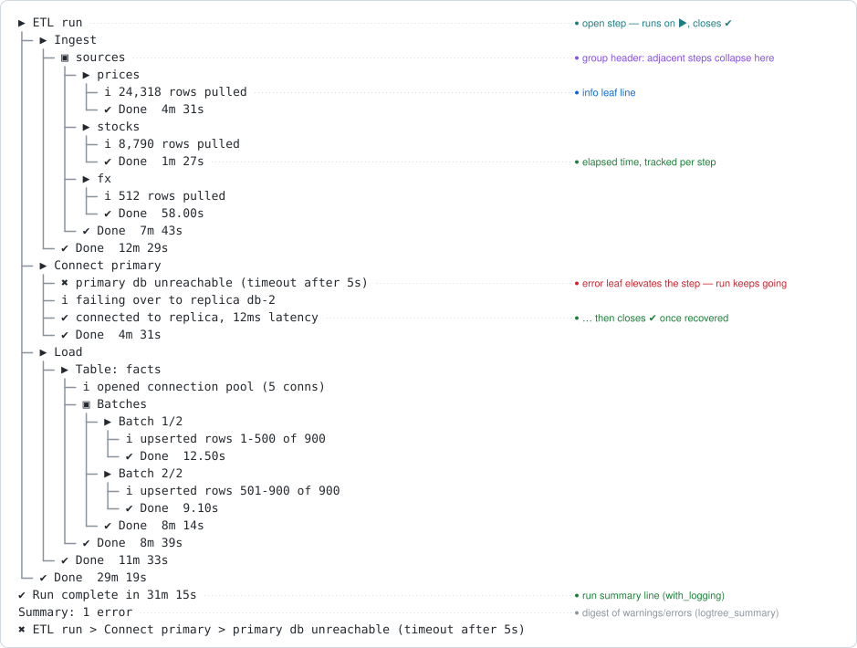

<!-- index.md is generated from index.Rmd. Please edit that file -->

# logtree <a href="https://ivansortino.github.io/logtree/"></a>

<!-- badges: start -->

[](https://github.com/IvanSortino/logtree/actions/workflows/R-CMD-check.yaml)
[](https://app.codecov.io/gh/IvanSortino/logtree)
<!-- badges: end -->

**logtree renders nested process execution as a live, colored tree in
the console** – tree connectors, status glyphs, and elapsed time per
step – and keeps nesting depth correct even when a step errors partway
through.

A step is opened by the function that does the work, and closes itself
when that function’s frame exits: normally, by an early `return()`, or
because an error unwound through it. Nothing has to be balanced by hand,
so the indentation can never drift out of sync with what is actually
running.

<p align="center">

</p>

## Installation

``` r
install.packages("logtree")

# or the development version
# install.packages("pak")
pak::pak("IvanSortino/logtree")
```

## Quick start

``` r
library(logtree)

load_config <- function() {
  log_step("Load config")
  log_info("reading config.yml")
  log_success("validated 12 parameters")
}

fetch_rows <- function() {
  log_step("Fetch rows")
  log_info("requesting from API")
  log_warn("rate limit at 80%")
  log_success("fetched 1,204 rows")
}

pipeline <- function() {
  log_step("Nightly pipeline")
  load_config()
  fetch_rows()
}

with_logging(pipeline())
#> ▶ Nightly pipeline
#> ├─ ▶ Load config
#> │  ├─ ℹ reading config.yml
#> │  ├─ ✔ validated 12 parameters
#> │  └─ ✔ Done  0.00s
#> ├─ ▶ Fetch rows
#> │  ├─ ℹ requesting from API
#> │  ├─ ⚠ rate limit at 80%
#> │  ├─ ✔ fetched 1,204 rows
#> │  └─ ⚠ Done  0.00s
#> └─ ✔ Done  0.01s
#> ✔ Run complete in 0.01s
logtree_summary()
#> 
#> ── Summary: 2 warnings ─────────────────────────────────────────────────────────
#> ⚠ Nightly pipeline › Fetch rows › rate limit at 80%
#> ⚠ Nightly pipeline › Fetch rows › rate limit at 80%
```

Three things happened without being asked for. `fetch_rows()` nested one
level under `pipeline()`, because it was called from inside it – neither
function passed the other a depth. The `log_warn()` line turned its own
step’s close glyph yellow, without throwing anything. And
`logtree_summary()` replayed that warning with the path it happened on,
so a run long enough to scroll does not have to be scrolled back
through.

## Features

Every feature has a section in the guide and a reference page.

| Feature             | What it does                                                                             | Guide                                                              | Reference                                                     |
|---------------------|------------------------------------------------------------------------------------------|--------------------------------------------------------------------|---------------------------------------------------------------|
| Self-closing steps  | A step closes when the function that opened it returns – normally, early, or on an error | [Steps](articles/logtree.html#steps-that-close-themselves)         | [`log_step()`](reference/log_step.html)                       |
| Leaf levels         | Five message levels under the current step                                               | [Leaf lines](articles/logtree.html#leaf-lines-and-levels)          | [`log_info()`](reference/log_info.html)                       |
| Status elevation    | A warning or error bumps its enclosing step’s glyph without throwing                     | [Status elevation](articles/logtree.html#status-elevation)         | [`log_warn()`](reference/log_warn.html)                       |
| Error handling      | An uncaught error marks every open step and is logged, then rethrown                     | [Uncaught errors](articles/logtree.html#uncaught-errors)           | [`with_logging()`](reference/with_logging.html)               |
| Routed R conditions | `warning()` and `message()` become leaves in the tree instead of stderr noise            | [Routing R conditions](articles/logtree.html#routing-r-conditions) | [`with_logging()`](reference/with_logging.html)               |
| Manual control      | Open and close steps by hand, for top-level scripts and block structure                  | [Manual step control](articles/logtree.html#manual-step-control)   | [`log_open()`](reference/log_open.html)                       |
| Grouping            | Adjacent steps sharing a value collapse under one header                                 | [Grouping](articles/logtree.html#grouping)                         | [`log_step()`](reference/log_step.html)                       |
| Verbosity           | A minimum level to render, globally or per sink                                          | [Verbosity](articles/logtree.html#verbosity)                       | [`logtree_threshold()`](reference/logtree_threshold.html)     |
| Run digest          | Every error, warning and pinned line since the last reset, with breadcrumbs              | [The run digest](articles/logtree.html#the-run-digest)             | [`logtree_summary()`](reference/logtree_summary.html)         |
| Call sites          | Annotate lines with `file.R:line fn()`, as a clickable link                              | [Call sites](articles/logtree.html#call-sites)                     | [`logtree_theme()`](reference/logtree_theme.html)             |
| Timestamps          | A fixed-width wall-clock column in front of every line                                   | [Timestamps](articles/logtree.html#timestamps)                     | [`logtree_theme()`](reference/logtree_theme.html)             |
| Themes              | Five presets – unicode, ascii, emoji, minimal, ci – and every slot overridable           | [Themes](articles/logtree.html#themes-and-presets)                 | [`logtree_theme()`](reference/logtree_theme.html)             |
| Layout              | Wrapping, indentation density, and the two glyph gaps                                    | [Layout and density](articles/logtree.html#layout-and-density)     | [`logtree_theme()`](reference/logtree_theme.html)             |
| File sinks          | Mirror the run to a plain-text or NDJSON file                                            | [Output sinks](articles/logtree.html#output-sinks)                 | [`logtree_sink_file()`](reference/logtree_sink_file.html)     |
| Custom sinks        | Register any function of one event; list and remove them                                 | [Output sinks](articles/logtree.html#output-sinks)                 | [`logtree_sink()`](reference/logtree_sink.html)               |
| Memory sink         | Collect events in a buffer and read them back as a data frame                            | [Testing your logging](articles/logtree.html#testing-your-logging) | [`logtree_sink_memory()`](reference/logtree_sink_memory.html) |
| Mute                | Silence every sink at once without unregistering any                                     | [Silence](articles/logtree.html#silence)                           | [`logtree_mute()`](reference/logtree_mute.html)               |
| `logger` bridge     | Route an existing `logger` codebase through logtree in one call                          | [logger integration](articles/logtree.html#logger-integration)     | [`logtree_logger()`](reference/logtree_logger.html)           |

## Where to go next

- **[Get started](articles/logtree.html)** – the full guide, one section
  per feature, each with a runnable example and its output.
- **[Examples](articles/examples.html)** – complete end-to-end runs: a
  nightly ETL, a migration that fails, a CI build log, asserting on your
  logging in tests.
- **[Themes cookbook](articles/themes.html)** – every theme slot and
  field, the five presets side by side, and recipes for building your
  own.
- **[Recipes](articles/recipes.html)** – top-level scripts, library
  authors, scheduled jobs, and the `logger` bridge.
- **[Reference](reference/index.html)** – all 23 exported functions.
- **[Design philosophy](articles/design.html)** – why depth is tied to
  frames and why the corner connector only ever appears on a close line.
