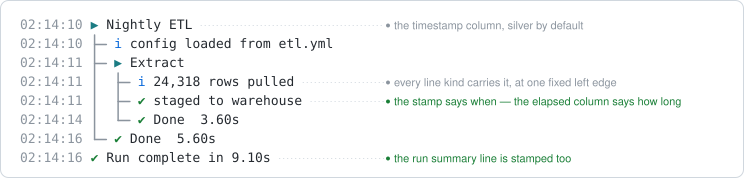

```{r, include = FALSE}
knitr::opts_chunk$set(
  collapse = TRUE,
  comment = "#>"
)
```

```{r setup}
library(logtree)
```

Everything `logtree_theme()` can change, and the reference tables for looking it
up. The [Get started guide](https://IvanSortino.github.io/logtree/articles/logtree.html#themes-and-presets)
covers the parts you need on day one; this is the rest.

```{r, include = FALSE}
demo <- function() {
  load_config <- function() {
    log_step("Load config")
    log_info("reading config.yml")
    log_success("validated 12 parameters")
  }
  pipeline <- function() {
    log_step("Pipeline")
    load_config()
    log_warn("using a stale cache")
  }
  logtree_reset()
  pipeline()
}
```

Every example below renders the same little tree, so the styling change is the
only difference:

```r
demo <- function() {
  load_config <- function() {
    log_step("Load config")
    log_info("reading config.yml")
    log_success("validated 12 parameters")
  }
  pipeline <- function() {
    log_step("Pipeline")
    load_config()
    log_warn("using a stale cache")
  }
  logtree_reset()
  pipeline()
}
```

## The five presets

```{r}
for (preset in c("unicode", "ascii", "emoji", "minimal", "ci")) {
  cat("\n", preset, "\n", sep = "")
  logtree_theme(preset)
  demo()
}
logtree_theme("unicode")
```

`"minimal"` drops the connectors entirely -- `branch`, `corner` and `pipe` are
empty strings, so a level costs nothing but its indentation. The trade is worth
knowing: `info`, `debug` and `interrupted` all render the middle dot and are
told apart by colour alone.

`"ci"` is built for log capture rather than a terminal. The bracketed words are
different lengths on purpose; each declares its true width, so the message
column still lines up.

## Overriding slots

`overrides` is a named list keyed by slot, each element holding only the fields
to change. Everything else is kept from the active theme.

```{r}
logtree_theme("unicode", overrides = list(
  success = list(glyph = "*", color = c("green", "bold")),
  group   = list(bracket = TRUE)
))
demo()
logtree_theme("unicode")
```

The tick on a `log_success()` line and the tick on a step's own close line are
two different slots -- `success` and `done` -- that merely ship the same glyph
in every preset. Restyle one and the other stays as it was:

```{r}
logtree_theme("unicode", overrides = list(
  done = list(glyph = "=", color = "silver")
))
demo()
logtree_theme("unicode")
```

### Accepted slots

| Slot | Applies to | Fields it accepts |
| ---- | ---------- | ----------------- |
| `step` | open / running step glyph | `glyph`, `width`, `color` |
| `info` | `log_info()` leaf | `glyph`, `width`, `color` |
| `debug` | `log_debug()` leaf | `glyph`, `width`, `color` |
| `success` | `log_success()` leaf | `glyph`, `width`, `color` |
| `done` | a step's own close line on a clean close | `glyph`, `width`, `color`, `text` |
| `warning` | `log_warn()` / elevated step glyph | `glyph`, `width`, `color`, `text` |
| `error` | `log_error()` / elevated step glyph | `glyph`, `width`, `color`, `text` |
| `interrupted` | abnormal-exit (dimmed) glyph | `glyph`, `width`, `color`, `text` |
| `group` | group header marker | `glyph`, `color`, `bracket` |
| `elapsed` | the elapsed-time column on every close line | `show`, `min`, `color`, `slow`, `slow_color` |
| `trace` | the optional call-site column | `show`, `format`, `color`, `capture` |
| `timestamp` | the optional wall-clock column | `format`, `color` |
| `branch` | child connector | `glyph`, `color` |
| `corner` | close-line connector | `glyph`, `color` |
| `pipe` | vertical rail | `glyph`, `color` |
| `crumb` | `logtree_summary()` breadcrumb separator | `glyph`, `color`, `path_color` |
| `summary` | `logtree_summary()` divider above the digest | `gap`, `rule`, `line` |

### Accepted fields

| Field | Type | Accepted values |
| ----- | ---- | --------------- |
| `glyph` | `character(1)` | Any string, including `""`. |
| `width` | `integer(1)` | Rendered display width of the glyph (`1` normal, `2` emoji/wide). Sets column alignment; status slots only. |
| `color` | `character` / `NULL` / `list` | One or more cli styles, or `NULL`. Named (`"red"`, `"cyan"`, ...), bright (`"br_red"`), backgrounds (`"bg_blue"`), styles (`"bold"`, `"dim"`, `"italic"`), or hex (`"#ff8800"`). A vector combines them. On `trace`, a named list styles the parts separately: `location`, `fn`, `base`. |
| `text` | `character(1)` | Close-line status slots only (`done`, `warning`, `error`, `interrupted`). The word a close line prints before its time; `""` drops it. Expands `{label}` and `{elapsed}`. |
| `show` | `logical(1)` / `character` | On `elapsed`, `FALSE` drops the time column. On `trace`, `FALSE` (default) is off, `TRUE` marks every line that can carry a call site, `"problems"` is shorthand for `c("warning", "error", "interrupted")`, and a status vector names exactly what to mark. |
| `format` | `character(1)` | On `trace`, a template over `{fn}`, `{file}`, `{line}`; default `"{file}:{line} {fn}()"`. On `timestamp`, a `strftime` format; `NULL` (the default) is off. |
| `capture` | `logical(1)` | `trace` only. `TRUE` records call sites even where `show` prints none. Default `FALSE`; it only ever adds. |
| `min` | `numeric(1)` | `elapsed` only. Hide times below this many seconds. |
| `slow` | `numeric(1)` / `NULL` | `elapsed` only. Times at or over this count as slow. |
| `slow_color` | `character` / `NULL` | `elapsed` only. Styles a slow time in place of `color`. |
| `bracket` | `logical(1)` | `group` only. `TRUE` wraps the header name in `< >`. |
| `path_color` | `character` / `NULL` | `crumb` only. Styles the breadcrumb's path nodes. |
| `gap` | `integer(1)` | `summary` only. Blank lines above the digest. |
| `rule` | `logical(1)` / `character(1)` | `summary` only. The divider drawn above the digest. |
| `line` | `integer(1)` / `character(1)` | `summary` only. The rule's line type. |

## Close lines and elapsed time

The word a step prints when it closes is the `text` field of a theme slot. It is
read from the closing status's own slot, falling back to `done`'s and then to
the built-in `"Done"` -- so one call renames every close line, and a narrower
one renames only the outcomes that went wrong. Two placeholders expand:
`{label}` (the step's own label, or a group's name) and `{elapsed}`.

```{r}
logtree_theme("unicode", overrides = list(
  done    = list(text = "{label} ok"),
  warning = list(text = "{label} finished with warnings")
))
demo()
logtree_theme("unicode")
```

`text` governs close lines only -- a `log_error()` leaf keeps its own message --
and `text = ""` drops the word entirely, leaving the glyph and the time.

The time itself is the `elapsed` slot. `min` hides anything faster than a
threshold, which is how you silence `0.00s` noise on trivial steps, while `slow`
and `slow_color` flag the ones worth noticing:

```{r}
logtree_theme("unicode", overrides = list(
  elapsed = list(min = 0.001, color = "silver", slow = 1, slow_color = "red")
))
demo()
logtree_theme("unicode")
```

`show = FALSE` drops the column outright. The `with_logging()` run summary line
takes the slot's colouring but never its hiding rules, since `Run complete in
<time>` would read as an unfinished sentence without its time.

## The timestamp column

`timestamp` puts a wall-clock column in front of every line. It ships `format =
NULL` in every preset, so it costs nothing until asked for.

```{r}
logtree_theme(list(timestamp = list(format = "%H:%M:%S")))
demo()
logtree_theme(list(timestamp = list(format = NULL)))
```

`"%H:%M:%S"` is the interactive choice; `"%Y-%m-%d %H:%M:%S"` is what a saved
log wants, since a file outlives the day it was written.

In the coloured presets the column ships `"silver"` -- supporting detail that
stays out of the way:

<p align="center">

</p>

`color` takes the same values as any other slot:

```{r}
logtree_theme(list(timestamp = list(format = "%H:%M:%S",
                                    color = c("bold", "blue"))))
demo()
logtree_theme(list(timestamp = list(format = NULL, color = "silver")))
```

Three properties worth knowing:

- The column is padded to a fixed width **measured from a rendered sample**, not
  from the format string, so a format whose width varies with the value cannot
  shear the tree from one line to the next.
- It counts against the wrapping budget like any other column, and a wrapped
  message's continuation rows carry a blank column rather than a repeated time.
- The digest is never stamped: it replays events that already happened, so the
  time it was printed would be the wrong answer.

A file sink pins its own column with `logtree_sink_file(timestamp = )`, and a
`"json"` sink always carries an ISO-8601 `ts` regardless.

## Styling the call-site column

`trace$color` takes either a character vector -- styling the whole column -- or
a named list styling its parts separately: `location` for a `{file}`/`{line}`
run, `fn` for the function name, and `base` for everything else, which in the
default format is the `()`.

```r
logtree_theme("unicode", overrides = list(
  trace = list(show = "problems", color = list(fn = "magenta"))
))
```

That split is why the coloured presets can keep the whole column dim while
still letting the location and the function name read apart. A run mentioning
`{file}`/`{line}` is treated as one unit -- separator included -- and carries a
single terminal hyperlink, so a click anywhere on it opens the file at that
line.

## Density and spacing

Four arguments control horizontal space. They are *scalars carried on the
theme*, not override slots: set them through `logtree_theme()`'s own arguments,
and the next preset swap clears them.

| Argument | The gap it sets |
| -------- | --------------- |
| `compact` | the per-level tree column: `"medium"` drops the trailing gap after each connector, `"tight"` also slims the connectors to one character |
| `connector_gap` | a leaf or close line's own connector, to its status glyph |
| `glyph_gap` | the status glyph, to the message text |
| `wrap` | the column budget a rendered line is capped at |

```{r}
logtree_theme("unicode", compact = "medium")
demo()

logtree_theme("unicode", compact = "tight", glyph_gap = 0)
demo()

logtree_theme("unicode")
```

`connector_gap` is unset by default and tracks the tree's own column gap, so
every preset renders as it always has. Setting it lets the two diverge -- which
is what it is for: `compact = "tight"` keeps every rail column flush while leaf
and close glyphs still get air.

```{r}
logtree_theme("unicode", compact = "tight", connector_gap = 1)
demo()
logtree_theme("unicode")
```

`wrap = TRUE` follows `cli::console_width()`, measured at render time; a number
pins a fixed width. A token with no break opportunity -- a long path, a URL --
is split by display width rather than left to overflow, and a budget narrower
than the tree is deep degrades to no wrapping rather than to an unusable
one-column line.

```{r}
logtree_theme("unicode", wrap = 50)
long <- function() {
  log_step("Deploy")
  log_info("uploading layers to registry.example.internal, 412 MB across 14 layers")
}
logtree_reset(); long()
logtree_theme("unicode")
```

None of the four reaches file sinks, which render through the ascii preset with
its built-in spacing.

## Recipes

### A branded palette

Hex colours work anywhere a cli style does, so a house palette is a single
`overrides` call.

```{r}
logtree_theme("unicode", overrides = list(
  step    = list(color = "#7c3aed"),
  info    = list(color = "#0ea5e9"),
  success = list(color = "#16a34a"),
  warning = list(color = "#f59e0b"),
  error   = list(color = "#dc2626"),
  done    = list(color = "#16a34a"),
  branch  = list(color = "#94a3b8"),
  pipe    = list(color = "#94a3b8"),
  corner  = list(color = "#94a3b8")
))
demo()
logtree_theme("unicode")
```

### A quiet tree

Drop the elapsed column, drop the close-line word, tighten the spacing: what is
left is structure and messages.

```{r}
logtree_theme("unicode",
  compact = "medium",
  overrides = list(
    elapsed = list(show = FALSE),
    done    = list(text = "")
  )
)
demo()
logtree_theme("unicode")
```

### A theme that survives log capture

Start from `"ci"` rather than restyling `"unicode"`: it is already colourless
and pure-ASCII. Add a timestamp, since a captured log is read after the fact.

```{r}
logtree_theme("ci", overrides = list(
  timestamp = list(format = "%Y-%m-%d %H:%M:%S")
))
demo()
logtree_theme("unicode")
```

### Emoji, with the alignment kept

Emoji cells are two columns wide, which is why every glyph declares its `width`
rather than having it measured -- `nchar()` cannot size them reliably. Set both
when you substitute one:

```{r}
logtree_theme("unicode", overrides = list(
  success = list(glyph = "\U0001f7e2", width = 2L),
  warning = list(glyph = "\U0001f7e1", width = 2L),
  error   = list(glyph = "\U0001f534", width = 2L)
))
demo()
logtree_theme("unicode")
```

Get the width wrong and the message column shears by a character on every line
that uses that glyph -- the one failure mode worth testing after a custom
preset.
