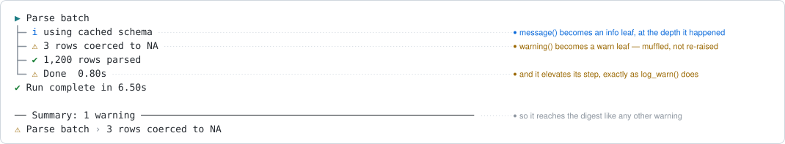

```{r, include = FALSE}
knitr::opts_chunk$set(
  collapse = TRUE,
  comment = "#>"
)
```

```{r setup}
library(logtree)
```

A live tree is read while it runs. A saved tree is read afterwards, usually
because something went wrong, and two things it never carried start to matter
then: **when** each line happened, and **everything R itself said** while the
run was going -- the `warning()` and `message()` calls that landed on stderr,
outside the tree, and are now in a different file or nowhere at all.

Two opt-in features answer those, and this article covers both end to end: the
`timestamp` theme slot, and `with_logging(warnings = )`.

Both are about colour as much as content -- a column faint enough to stay out
of the way, a warning that turns its step yellow -- and the chunk output on
this page is monochrome, because pkgdown evaluates it with no terminal
attached. Where the colour is the point, a rendered SVG of the real terminal
output sits next to the chunk.

## The timestamp column

### Turning it on

`timestamp` is an ordinary theme slot, set through `logtree_theme()` like any
glyph. It ships `format = NULL` in every preset -- off -- so the default path
pays nothing. Give it a `strftime` format and every line gets a wall-clock
column in front of it.

```{r}
logtree_reset()

etl <- function() {
  log_step("Nightly ETL")
  log_info("config loaded from etl.yml")
  extract()
}

extract <- function() {
  log_step("Extract")
  log_info("24,318 rows pulled")
  log_success("staged to warehouse")
}

logtree_theme(list(timestamp = list(format = "%H:%M:%S")))
with_logging(etl())
logtree_theme(list(timestamp = list(format = NULL)))
```

`"%H:%M:%S"` is the interactive choice; `"%Y-%m-%d %H:%M:%S"` is what a saved
log wants, since a file outlives the day it was written.

### The silver default

The column is supporting detail -- you read the tree, and consult the time only
when you need it -- so it is styled `"silver"` in the coloured presets, faint
enough that the status glyphs stay the thing your eye lands on. That is what
the terminal actually renders:

<p align="center">

</p>

Every line kind takes the column, at one fixed left edge: step opens, leaves,
close lines, group headers and group corners, and `with_logging()`'s own run
summary. The tree to the right of it is byte-for-byte what it would have
printed without the column, just moved right by one constant width.

`color` takes the same values as any other slot -- one or more cli styles, or
`NULL` for no styling at all:

```{r}
logtree_theme(list(timestamp = list(format = "%H:%M:%S",
                                    color = c("bold", "blue"))))
logtree_reset()
etl()
logtree_theme(list(timestamp = list(format = NULL, color = "silver")))
```

The `"ascii"` and `"ci"` presets ship `color = NULL` instead, because they
exist for log capture, where an ANSI escape is noise a runner may or may not
strip.

### Fixed width, whatever the format

The column is padded to a **fixed** width, measured by rendering a sample
timestamp rather than by looking at the format string. This matters for any
format whose width varies with the value: `"%B"` renders `March` in one month
and `December` in another, and a tree that trusted the format string's length
would shear left and right between two such lines. It does not -- the shorter
value is padded, and the message column stays where it was. (`"%-d"`, the
unpadded day-of-month, is the sharper example, but the `-` flag is a glibc
extension: Linux renders `5`, macOS and Windows render the literal `-d`.)

That also means the column costs the same on every line, which is what lets the
rest of the layout ignore it entirely.

### What is *not* stamped

`logtree_summary()`'s digest carries no column at all:

```{r}
logtree_theme(list(timestamp = list(format = "%H:%M:%S")))
logtree_reset()

flaky <- function() {
  log_step("Import")
  log_warn("3 rows coerced to NA")
}
with_logging(flaky(), summary = FALSE)
logtree_summary()

logtree_theme(list(timestamp = list(format = NULL)))
```

The digest replays events that already happened. Stamping those lines with the
moment the digest was printed would be a plausible-looking wrong answer, so
they get no stamp rather than a misleading one. The same reasoning gives a
wrapped message's continuation rows a *blank* column instead of a repeated
time: one event happened once.

```{r}
logtree_theme("unicode", wrap = 58,
              overrides = list(timestamp = list(format = "%H:%M:%S")))
logtree_reset()

long <- function() {
  log_step("Deploy")
  log_info("uploading layers to registry.example.internal, 412 MB across 14 layers")
}
long()

logtree_theme("unicode")
```

The column counts against the wrapping budget like any other column, so a
message breaks exactly one column-width earlier than it would without one.

### Timestamps in file sinks

A file sink follows the console theme by default and pins its own column with
`logtree_sink_file(timestamp = )`: `FALSE` for none, `TRUE` for the
`"%Y-%m-%d %H:%M:%S"` form suited to a file that outlives the session, or a
format string of your own. So the console can stay uncluttered while the file
records when everything happened.

```{r}
path <- tempfile(fileext = ".log")
h <- logtree_sink_file(path, format = "text", timestamp = TRUE)

logtree_reset()
etl()                       # console: no column (the theme's is off)

writeLines(readLines(path)) # file: stamped
logtree_sink_remove(h)
```

A `"json"` sink ignores the argument: every record already carries a `ts`
field, ISO-8601 to the millisecond with a UTC offset, alongside the `run_id`
that ties one run's records together.

```{r}
json_path <- tempfile(fileext = ".ndjson")
h <- logtree_sink_file(json_path, format = "json")

logtree_reset()
flaky()

writeLines(readLines(json_path)[1:2])
logtree_sink_remove(h)
```

All sinks stamp from **one** clock reading taken when the event is emitted, not
one reading per sink -- so a run replayed from a file lines up with the same
run replayed from the memory sink, to the millisecond.

### The slot, in full

| Field | Type | What it does |
| ----- | ---- | ------------ |
| `format` | `character(1)` / `NULL` | A `strftime` format. `NULL` (every preset) is off. |
| `color` | `character` / `NULL` | cli styles for the column. `"silver"` in the coloured presets, `NULL` in `"ascii"` and `"ci"`. |

Related arguments elsewhere: `logtree_sink_file(timestamp = )` pins a file
sink's column, and the `elapsed` slot is the *other* time column -- how long a
step took, printed on its close line. The two are independent, and answer
different questions.

## Routing R's own conditions

### The problem

`with_logging()` already handles errors: every open step is marked failed, the
message is logged as a leaf, and the error is rethrown. But an ordinary
`warning()` or `message()` from the code you wrapped -- or from a package it
calls -- goes to stderr, in its own order, with no idea what step was running.
The tree ends up being half the record of the run.

```{r}
logtree_reset()

parse_batch <- function() {
  log_step("Parse batch")
  message("using cached schema")
  warning("3 rows coerced to NA")
  log_success("1,200 rows parsed")
}

with_logging(parse_batch(), summary = FALSE)
```

Neither condition is a tree line: no connector, no glyph, no depth, no place in
the structure. They went to stderr -- knitr happens to interleave that stream
into the chunk output here, but in a scheduled job it is a different stream and
usually a different file, so the tree you keep is missing both.

### `warnings = TRUE`

Switch routing on and each becomes a leaf line, at the depth where it actually
happened: a `warning()` becomes a `log_warn()` leaf, a `message()` becomes a
`log_info()` leaf.

```{r}
logtree_reset()
with_logging(parse_batch(), warnings = TRUE, summary = FALSE)
```

In colour, that reads as one record of the run -- the warning yellow, its step
elevated to yellow with it, and the digest picking it up:

<p align="center">

</p>

### What it costs

Routing means **muffling**, and that is the whole trade:

* A routed condition **stops at the leaf**. It no longer reaches `warnings()`,
  the caller's own `tryCatch()`/`withCallingHandlers()`, or stderr. The tree
  becomes the single record of the run -- which is the point, but it means code
  outside that was watching for the warning no longer sees it.
* A routed warning **elevates its enclosing step**, exactly as `log_warn()`
  does. Wrapping third-party code that warns freely will turn steps yellow. That
  is honest, but it may be more honesty than you wanted from a dependency you do
  not control.

Neither applies to errors: those are handled by `with_logging()` whether or not
you ask for routing, and are always rethrown after being logged.

### Routing one kind and not the other

`warnings` also takes a subset, which is the usual way out of the trade above:

```{r}
logtree_reset()
with_logging(parse_batch(), warnings = "message", summary = FALSE)
```

`"message"` routes `message()` only -- chatty progress output comes into the
tree, while warnings stay on stderr, still reach `warnings()`, and leave every
step's status alone. `"warning"` is the mirror image: warnings become leaves,
`message()` is left exactly as it was.

| `warnings =` | `warning()` | `message()` |
| ------------ | ----------- | ----------- |
| `FALSE` (default) | stderr, untouched | stderr, untouched |
| `TRUE` | `log_warn()` leaf, muffled, elevates the step | `log_info()` leaf, muffled |
| `"warning"` | `log_warn()` leaf, muffled, elevates the step | stderr, untouched |
| `"message"` | stderr, untouched | `log_info()` leaf, muffled |

### Routed leaves are ordinary leaves

Once routed, a condition is a leaf like any other, so everything downstream
treats it the same way:

* It fans out to **every registered sink**, so a routed warning lands in a log
  file and a `"json"` record, not only on screen.
* It is subject to `logtree_threshold()` -- and per-sink thresholds -- for
  *rendering* only. A routed warning suppressed from the console still elevates
  its step and still reaches the digest.
* It appears in `logtree_summary()`, with the breadcrumb of the step it
  happened under.

```{r}
h <- logtree_sink_memory()

logtree_reset()
with_logging(parse_batch(), warnings = TRUE, summary = FALSE)

logtree_sink_memory_events(h)[, c("level", "depth", "label", "status")]
logtree_sink_remove(h)
```

That last one is the shape of a test: run the pipeline, assert on the recorded
events, and never pattern-match a rendered glyph.

### Global mode

At the top level of a script there is no frame to wrap, which is what
`with_logging(global = TRUE)` is for. It takes `warnings` too:

```r
with_logging(global = TRUE, warnings = TRUE)

log_open("Nightly ETL")
warning("3 rows coerced to NA")   # a leaf under the open step
```

The handler is session-persistent, so routing is deliberately narrower there:
it applies **only while logtree steps are open**. A warning raised before the
first step or after the last one behaves exactly as it always did, so a handler
installed at the top of a script cannot quietly swallow warnings from unrelated
code later in the session. `logtree_reset()` removes it.

## Both together: a scheduled job

The two features are aimed at the same reader -- someone opening a log after
the fact -- and compose into one setup worth copying:

```{r}
log_file <- tempfile(fileext = ".log")

etl_job <- function() {
  log_step("Nightly ETL")
  log_debug("connection pool: 5")
  message("using cached schema")
  warning("3 rows coerced to NA")
  log_success("1,200 rows parsed")
}

nightly <- function() {
  h <- logtree_sink_file(log_file, format = "text",
                         timestamp = TRUE,     # when each line happened
                         threshold = "debug")  # the file keeps everything
  on.exit(logtree_sink_remove(h), add = TRUE)

  # The steps live in etl_job(), not in the block: a step opened directly
  # inside `{ ... }` closes when *nightly()* returns, which is after
  # with_logging() has already printed its run-summary line.
  with_logging(etl_job(), warnings = TRUE)     # R's own output, in the tree
}

logtree_reset()
logtree_threshold("info")   # the console stays readable
nightly()

writeLines(readLines(log_file))
```

The console showed an `info`-level tree with no timestamps; the file kept the
debug line, the routed message and warning, and a stamp on every row. One run,
one record, and the digest still knows what went wrong.

```{r, include = FALSE}
logtree_reset()
logtree_threshold("info")
logtree_theme("unicode")
```

## See also

* `vignette("logtree")` -- the Themes and `with_logging()` sections of the
  get-started guide.
* `?logtree_theme` for the full slot/field reference, `?with_logging` for the
  `warnings` argument, and `?logtree_sink_file` for `timestamp =` and
  `threshold =`.
